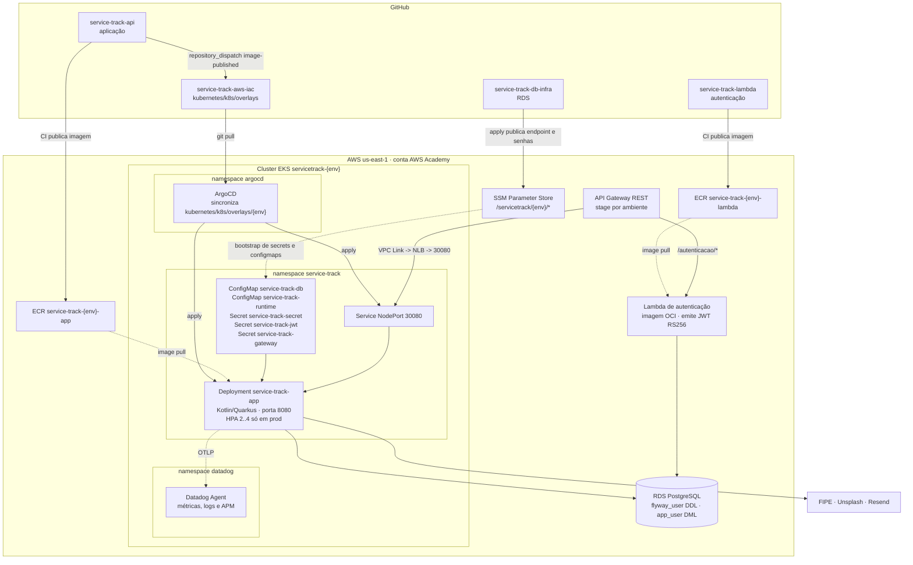

# Diagrama de deployment

Mapeamento software → nó de execução na Fase 3. Substitui o C4 nível 4 da Fase 2, que
descrevia o cluster `servicetrack-dev` e o ArgoCD lendo `infra/k8s/overlays/prod` de dentro do
repositório da aplicação — arranjo que deixou de existir com `API-ADR-020`.

**Fonte de verdade:** `iac/modules/stack/`, `kubernetes/k8s/overlays/<env>/` e
`kubernetes/argocd/`.

---

## Diagrama

---

## O que roda onde

| Componente | Nó de execução | Imagem / origem |
|---|---|---|
| Aplicação | Pod no node group do EKS | `ECR service-track-<env>-app`, tag reescrita pelo `repository_dispatch` |
| Autenticação | Lambda, ENI na subnet privada | `ECR service-track-<env>-lambda` |
| Roteamento e API key | API Gateway, gerenciado | `apis/service-track-api-ext/openApi.yaml` |
| Banco | RDS na subnet privada | `service-track-db-infra` |
| Entrega contínua | ArgoCD no próprio cluster | `kubernetes/k8s/overlays/<env>` deste repositório |
| Observabilidade em nuvem | Datadog Agent, DaemonSet + cluster agent | Helm, provisionado por Terraform |

---

## Acoplamentos que o desenho torna visíveis

**NodePort 30080** é o único contrato declarado entre o Terraform e os manifestos. O `base` do
Kustomize é `ClusterIP`; o NodePort vem do overlay. Mudou de um lado, muda dos dois
(`IAC-ADR-012`).

**O ArgoCD lê deste repositório, não do da aplicação.** A aplicação publica a imagem e dispara
`repository_dispatch`; quem reescreve `newTag` no overlay é a esteira daqui (`IAC-ADR-015`).
Essa inversão é o que permitiu remover `infra/` e `k8s/` da API.

**Os segredos não vêm do Git.** Nada que o ArgoCD gerencia contém senha. O bootstrap lê do SSM
e cria os Secrets no cluster (`IAC-ADR-022`), porque External Secrets com IRSA está bloqueado
pela `LabRole` do AWS Academy.

**O overlay de produção chama-se `prod`, o ambiente Terraform chama-se `prd`.** Os dois nomes
convivem: `iac/environments/prd/` aplica a infraestrutura, `kubernetes/k8s/overlays/prod/` é o
que o ArgoCD sincroniza. Errar o nome ao montar caminho é falha silenciosa — o Kustomize
simplesmente não acha o diretório.

**Só `prod` tem HPA.** `kubernetes/k8s/overlays/prod/hpa.yaml` define 2..4 réplicas com CPU a
70% e memória a 80%. As 4 cabem em um único `t3.medium`, então a escala não espera node novo. O overlay `hml` não sobrescreve réplicas e roda no valor do `base`, o que
é coerente com o enxugamento de HML por custo (`IAC-ADR-014`). Ao mexer nesse teto, rever o
orçamento de conexões do banco (`DB-ADR-004`).

**Primeiro apply de um ambiente deixa os pods em `ImagePullBackOff`.** O ECR nasce vazio no
mesmo apply que cria o cluster. É esperado até a primeira publicação de imagem, não é defeito.
