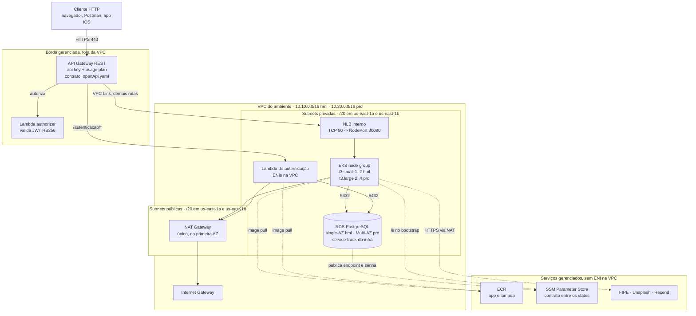

# Topologia de rede

Estado atual da Fase 3. Substitui o desenho de rede da Fase 2, que descrevia o cluster
`servicetrack-dev` e permanece em `service-track-api/docs/mvp-2/` como registro histórico.

**Fonte de verdade:** `iac/network/<env>/main.tf` e `iac/modules/network/`.
Ao alterar CIDR, AZ ou rota, atualizar este diagrama no mesmo ciclo.

---

## Diagrama



---

## Decisões que o desenho materializa

**Duas AZs em ambos os ambientes.** As subnets são criadas com `count = length(var.azs)` e
`azs = ["us-east-1a", "us-east-1b"]` nos dois. Isso não é redundância completa: o **NAT
Gateway é único**, na primeira AZ. Perder `us-east-1a` derruba a saída para a internet dos
nodes das duas AZs. É escolha de custo (`IAC-ADR-014`) — um NAT por AZ dobra a conta do item
mais caro depois do control plane.

O que as duas AZs entregam de fato: o EKS exige subnets em pelo menos duas AZs, o RDS
Multi-AZ de PRD precisa de duas para o standby, e o NLB do VPC Link distribui entre elas.

**Só o API Gateway é público.** Não há Load Balancer interno-externo para a aplicação: o NLB
é `internal = true`, e os nodes só aceitam tráfego na porta 30080 vindo do SG do NLB. O
acesso direto é fechado por header compartilhado, não por rede — ver `IAC-ADR-017` para o
porquê de a rede sozinha não conseguir fechar.

**O RDS não nasce aqui.** É do `service-track-db-infra`, aplicado entre a rede e o stack. O
security group do banco nasce sem regra de entrada e é este repositório que cria o ingress
apontando para o SG dos nodes e da Lambda (`DB-ADR-003`).

**A VPC morre a cada `destroy`.** CIDR, IDs de subnet e o DNS do NLB são todos recriados.
Nada aqui pode ser copiado para documentação ou cliente — ver `IAC-ADR-006`.

---

## Ordem de criação

```
1. iac/network/<env>        VPC, subnets, IGW, NAT, rotas
2. service-track-db-infra   RDS dentro das subnets privadas
3. iac/environments/<env>   EKS, Lambda, NLB, VPC Link, gateway, ingress no SG do banco
```

Destruir é o inverso, e `scripts/aws-lb-cleanup.sh` precisa rodar antes, senão a remoção da
VPC falha por ENI órfã do NLB.
